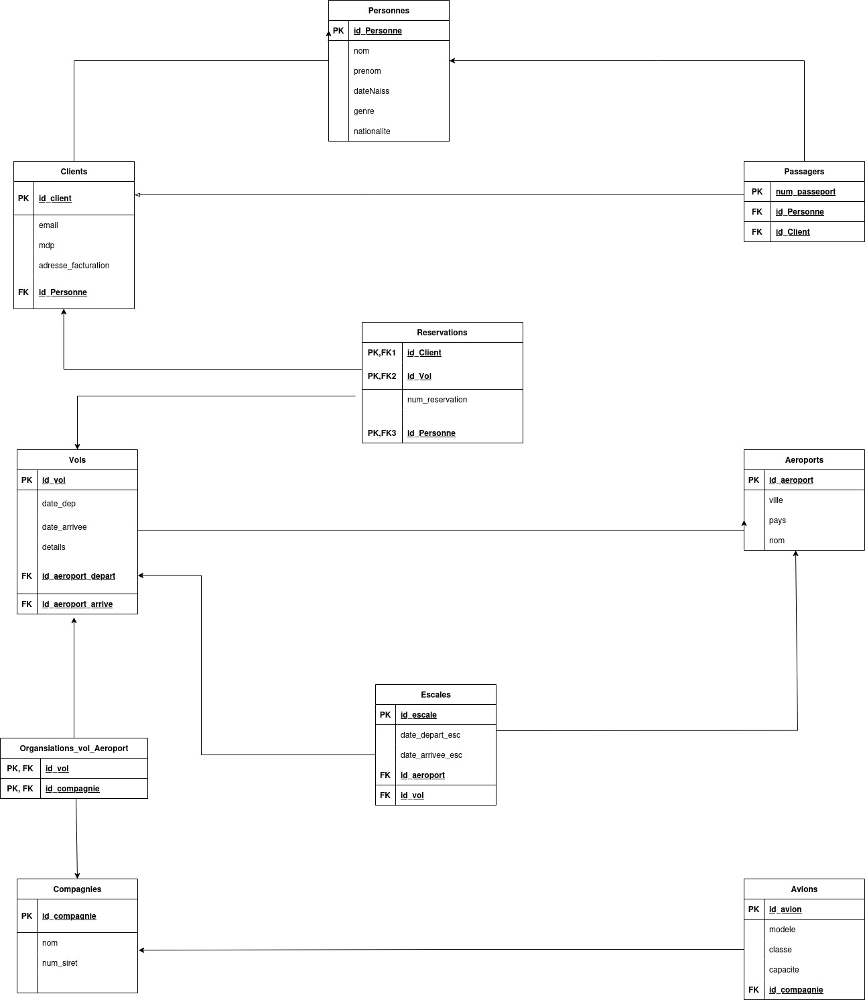

# MLD : Script : 

- Personnes (**id_personne**, nom, prenom, dateNaiss, email, genre, nationalite)
- Clients (**id_Client**; #id_personne, email, mdp, adresse_facturation)
- Passagers (**num_passeport**, #id_personne, #id_client)
- Vol (**id_vol**, date_dep, date_arriver, details)
- Reservations (**#(id_client, id_vol, #id_passager**), num_reservation)
- Organsiations_vol_Aeroport (**#(id_vol, oaci)**)
- Escales (**id_escale**, #id-vol, date_depart_esc, date_arriver_esc)
- Aeroports (**oaci**, nom, ville, pays)
- Compagnies (**iata**, nom, num_siret)
- Avion (**id_avion**, #iata, modele, classe, capacite)

FK : **#**  
PK : **pk**

# MLD Schéma 

